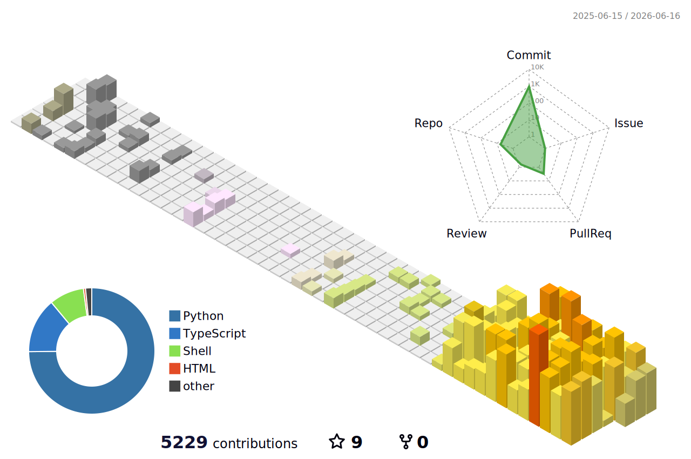

### Hi, I'm Tianli

Water resources engineer & Python developer in Hangzhou. I build tools to automate document processing and engineering workflows, with a focus on Claude Code context engineering.

**Projects I built and use every day:**

- [dockit](https://github.com/zengtianli/dockit) — Document processing toolkit for Word, PowerPoint, and Excel. Bytes in, bytes out
- [scripts](https://github.com/zengtianli/scripts) — 70+ macOS utility scripts with Raycast integration
- [claude-config](https://github.com/zengtianli/claude-config) — Claude Code context engineering: rules, standards, skills, agents, memory
- [sync](https://github.com/zengtianli/sync) — macOS dotfiles: Zsh, Neovim, Yabai, Hammerspoon, and more
- [vps](https://github.com/zengtianli/vps) — VPS setup guide: Nginx reverse proxy, Cloudflare, self-hosted services

**Tech stack:**

