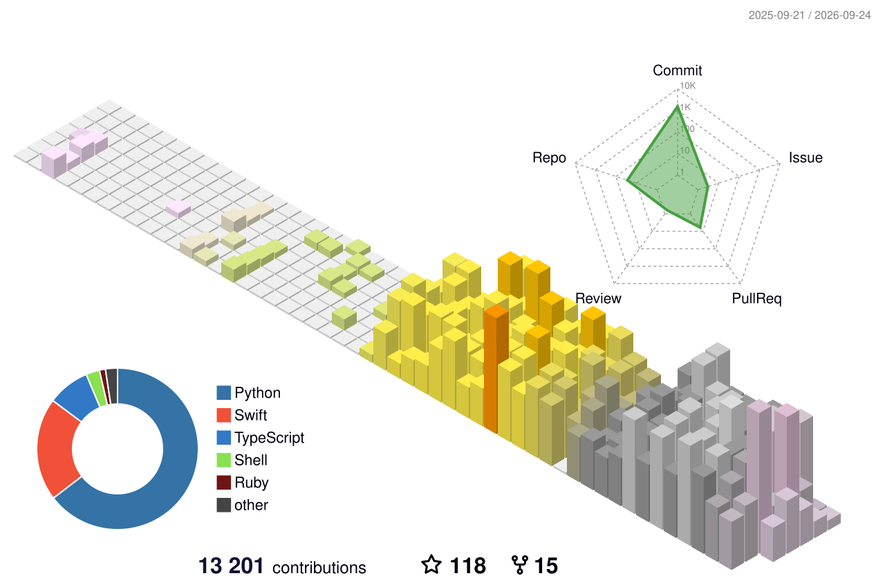

### 曾田力 · Tianli

全栈工程师，做的东西自己每天在用：iPhone / macOS 原生 app、Python 后端与 LLM agent、Next.js 站点、自己运维的 VPS。水利工程师出身，所以 agent 和计算器都长在水利这个领域上。

**正在维护、有人在用的**

- [WeChatTweak](https://github.com/zengtianli/WeChatTweak) — 微信 4.x 防撤回。上游停更后接手，字节补丁 + 阻止自动更新 + 一键还原，Swift CLI
- [WeChatUnrevoke](https://github.com/zengtianli/WeChatUnrevoke) — 上面那个引擎的图形界面，点一下就好；`brew install --cask zengtianli/tap/wechat-unrevoke`
- [homebrew-tap](https://github.com/zengtianli/homebrew-tap) — 以上两个的 Homebrew 分发

**iPhone 舰队**（2026-08-18 到 08-31，14 天从第一行 Swift 到 10 个原生 app，9 个上了 TestFlight，约 2.1 万行）

- [hydro-deck](https://github.com/zengtianli/hydro-deck) — 水利 agent 的手机端：SSE 流式、步骤可视化、答案带引文、断线取回
- [wrong-book](https://github.com/zengtianli/wrong-book) — 小学错题本：错过的题型换道新题再考，整卷用系统文档扫描器录入
- [fitcoach-ios](https://github.com/zengtianli/fitcoach-ios) — 给真实教练做的课时系统手机端，与网页端、小程序端共用同一后端
- [options-calc](https://github.com/zengtianli/options-calc) · [options-desk](https://github.com/zengtianli/options-desk) — 期权卖方决策台 / 投资盘面
- [points-deck](https://github.com/zengtianli/points-deck) · [day-deck](https://github.com/zengtianli/day-deck) · [blog-reader](https://github.com/zengtianli/blog-reader)
- 怎么做到的写成了一篇教程：[从零到 TestFlight：一个人做 iPhone app 的完整路径](https://blog-ai.tianli.cyou/nine-ios-apps-in-two-weeks)

**macOS**

- [hydro-mac](https://github.com/zengtianli/hydro-mac) — 八个水利计算器合成一个 app（Rust 计算核 + SwiftUI）
- [ask-claude](https://github.com/zengtianli/ask-claude) — Mac 上直接问 Claude，走会员额度不另配 key
- [doc-tools](https://github.com/zengtianli/doc-tools) — 批量规范化 / 转换 / 套模板出 Word

**全部产品目录**：<https://apps.tianli.cyou> · 博客：<https://blog.tianli.cyou> · 个人站：<https://tianli.cyou>

---

English

Full-stack engineer. Everything here is something I use daily: native iPhone / macOS apps in Swift, Python backends and LLM agents, Next.js sites, a self-run VPS behind Cloudflare. Water-resources engineer by training, which is why the agent and the calculators live in that domain.

- **WeChatTweak / WeChatUnrevoke / homebrew-tap** — keep recalled messages on WeChat 4.x for macOS; CLI engine, one-click GUI, Homebrew distribution. Maintained after upstream went quiet.
- **iPhone fleet** — 10 native apps in 14 days (Aug 18–31, 2026), 9 on TestFlight, ~21k lines of Swift. Write-up: [Zero to TestFlight](https://blog-ai.tianli.cyou/nine-ios-apps-in-two-weeks).
- **macOS** — hydro-mac (Rust core + SwiftUI), ask-claude, doc-tools.
- Catalog: <https://apps.tianli.cyou> · Blog: <https://blog.tianli.cyou>

